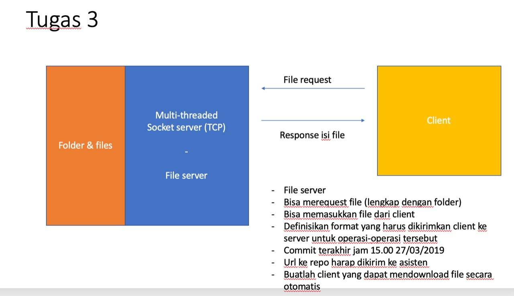
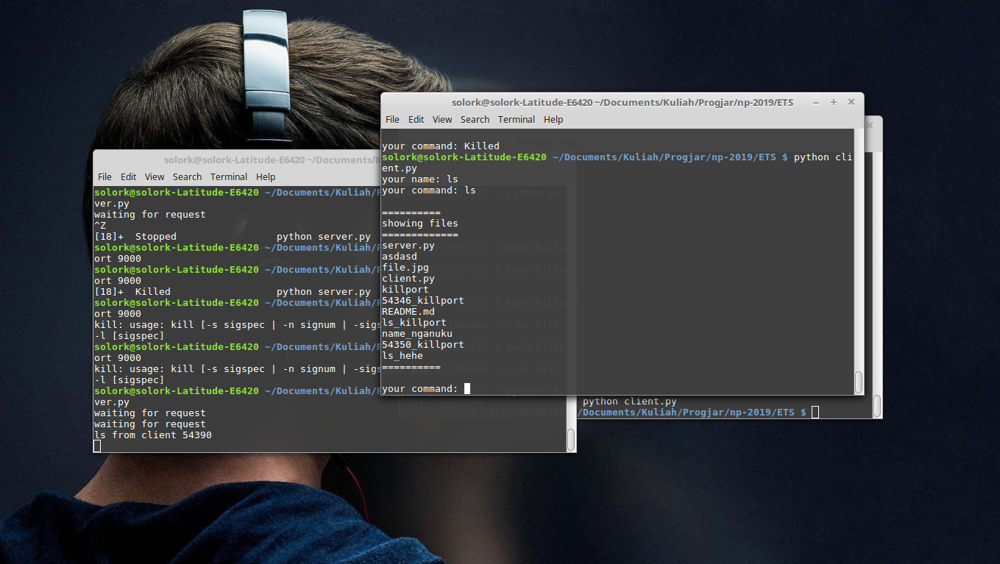
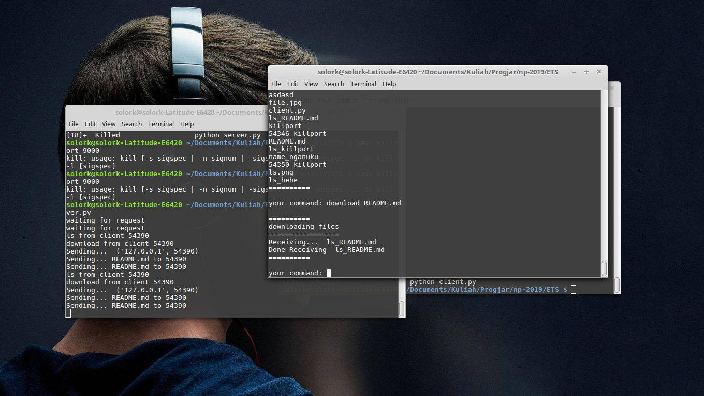
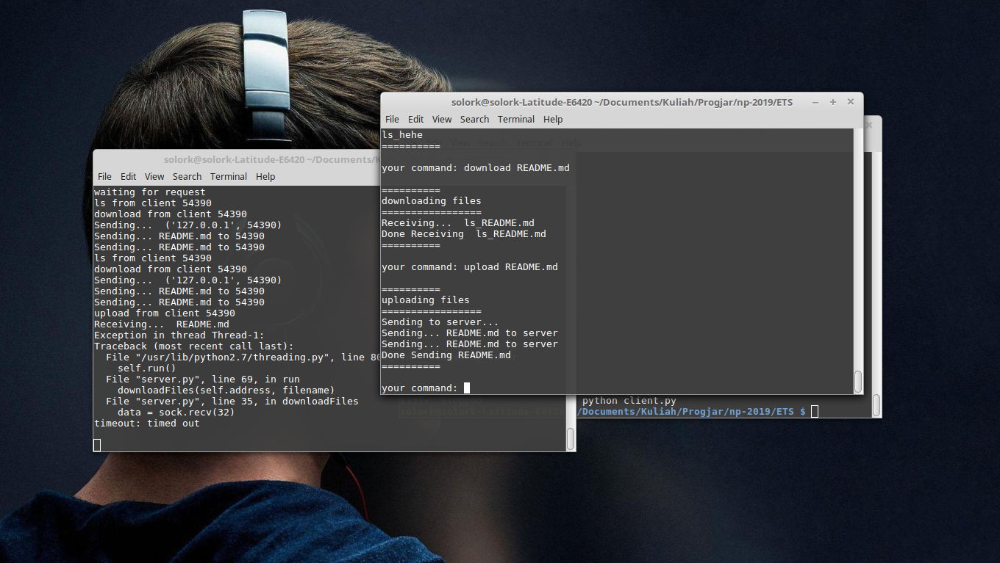

# Mid-Test Assignment
## Faizal Khilmi Muzakki - 05111640000120

#### Description

#### How to run
- `python server.py`
- `python client.py`

#### Client Command List
- `ls` (show list file on server)
- `download [filename]` (download file from server)
- `upload [filename]` (upload file to server)

#### Testing

1. ls

2. download

3. upload

